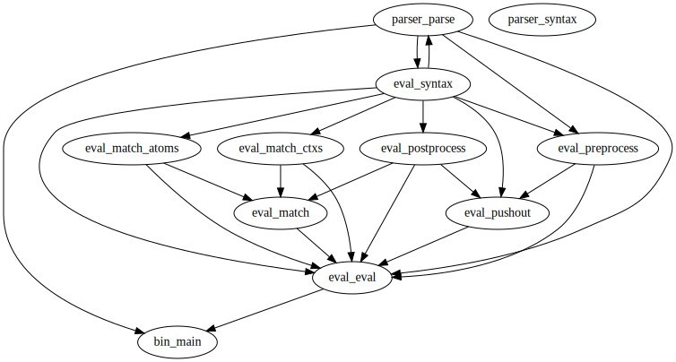

# A Reference Interpreter of the Lambda GT Language

[](#license)
[](https://twitter.com/sano65747676)


Graphs are a generalized concept that encompasses more complex data structures than trees,
such as difference lists, doubly-linked lists, skip lists, and leaf-linked trees.
Normally, these structures are handled with destructive assignments to heaps,
as opposed to a purely functional programming style.

We propose a new purely functional language, λGT,
that handles graphs as immutable, first-class data structures with
a pattern matching mechanism based on Graph Transformation.

We implemented a reference interpreter, a reference implementation of the language.
We believe this is usable for further investigation, including in the design of real languages based on λGT.
The interpreter is written in only 500 lines of OCaml code.

We also have [a visualizing tool that runs on a browser](https://sano-jin.github.io/lambda-gt-online/).

## Getting Started

### Prerequisites

- [opam](https://opam.ocaml.org/)

### Installation

```bash
git clone https://github.com/sano-jin/lambda-gt-alpha.git
cd lambda-gt-alpha
opam install .
dune build
```

## Usage

```bash
./run example/dlist.lgt
```

which will result in `{_Y >< _X}`.

See [/example](example) for more examples.

## Syntax

```
Expression     e ::= { T }                                  // Graph
                  |  e1 e2                                  // Application
                  |  case e1 of e2 -> e3 | otherwise -> e4  // Case Expression

Graph Template T ::= v (_X1, ..., _Xn)                      // Atom
                  |  _X >< _Y                               // Fusion
                  |  x[_X1, ..., _Xn]                      // Graph Context
                  |  (T, T)                                 // Molecule
                  |  nu _X. T                               // Link Creation

Atom Name      v ::= Constr                                 // Constructor Name
                  |  <\x[_X1, ..., _Xn]. e>                 // Lambda Abstraction
```

For the syntax and semantics, please see
[the paper[1]](http://jssst.or.jp/files/user/taikai/2022/papers/20-L.pdf).

- We have enabled logging.

  ```ocaml
  {Log} exp
  ```

  evaluates `exp`, prints the value, and results in the value.

## Development



Please give me issues or pull requests if you find any bugs or solutions for them.

We aim to build the simplest implementation.
Thus, we may not accept a request for an enhancement.
However, we appreciate it because it will be helpful in the design and implementation
of the _real_ language based on this POC.

### Testing

```bash
dune runtest
```

See [test/test.ml](test/test.ml) for more information.

- Configure tests with the file.

### Directory Structures

[/bin](bin):
entry point

| File                   | Description                          |
| ---------------------- | ------------------------------------ |
| [main.ml](bin/main.ml) | Read a file and execute the program. |

[/eval](eval):
evaluator

| File                                  | Description                                                                                    |
| ------------------------------------- | ---------------------------------------------------------------------------------------------- |
| [syntax.ml](eval/syntax.ml)           | Syntax of atoms as an list.                                                                    |
| [preprocess.ml](eval/preprocess.ml)   | Transform an AST graph to a list of atoms. Alpha convert link names.                           |
| [eval.ml](eval/eval.ml)               | The evaluator.                                                                                 |
| [match.ml](eval/match.ml)             | Matches atoms and graph contexts and returns the obtained graph substitutions.                 |
| [match_atoms.ml](eval/match_atoms.ml) | Matches atoms and returns the link mappings and the rest graph.                                |
| [postprocess.ml](eval/postprocess.ml) | Transform the link names in the rest graphs and supply fusions according to the link mappings. |
| [match_ctxs.ml](eval/match.ml)        | Matches graph contexts and returns the obtained graph substitutions.                           |
| [pushout.ml](eval/pushout.ml)         | Substitute graph contexts with the given graph substitution (rewriting after matching).        |

[/parser](parser):
lexical/syntactical analyzer

| File                            | Description                   |
| ------------------------------- | ----------------------------- |
| [syntax.ml](parser/syntax.ml)   | AST definition                |
| [lexer.mll](parser/lexer.mll)   | Defines a token for lexing    |
| [parser.mly](parser/parser.mly) | Defines a grammar for parsing |
| [parse.ml](parser/parse.ml)     | Parser                        |

## Citation

1. ([pdf](http://jssst.or.jp/files/user/taikai/2022/papers/20-L.pdf),
   [slide](https://www.ueda.info.waseda.ac.jp/~sano/materials/jssst2022.pdf))
   A functional language with graphs as first-class data,
   In Proc. The 39th JSSST Annual Conference, 2022
   (15pp. unreferred).
   <details><summary>Abstract</summary><div>
     Graphs are a generalized concept that encompasses more complex data structures than trees,
     such as difference lists, doubly-linked lists, skip lists, and leaf-linked trees. Normally, these structures are handled
     with destructive assignments to heaps, as opposed to a purely functional programming style. We proposed
     a new purely functional language, λGT, that handles graphs as immutable, first-class data structures with
     a pattern matching mechanism based on Graph Transformation. Since graphs can be more complex than
     trees and require non-trivial formalism, the implementation of the language is also more complicated than
     ordinary functional languages. λGT is even more advanced than the ordinary graph transformation systems.
     We implemented a reference interpreter, a reference implementation of the language. We believe this
     is usable for further investigation, including in the design of real languages based on λGT. The interpreter
     is written in only 500 lines of OCaml code.
   </div></details>
2. ([arXiv](https://arxiv.org/abs/2209.05149),
   [slide](https://www.ueda.info.waseda.ac.jp/~sano/materials/pro2022.pdf))
   Type checking data structures more complex than tree,
   to be appeared in Journal of Information Processing, 2022 (19pp. refferred).
   <details><summary>Abstract</summary><div>
     Graphs are a generalized concept that encompasses more complex data structures than trees,
     such as difference lists, doubly-linked lists, skip lists, and leaf-linked trees.
     Normally, these structures are handled with destructive assignments to heaps,
     which is opposed to a purely functional programming style and makes verification difficult.
     We propose a new
     purely functional language, \\(\lambda_{GT}\\), that handles graphs as immutable,
     first-class data structures with a pattern matching mechanism
     based on Graph Transformation and developed a new type system, \\(F_{GT}\\), for the language.
     Our approach is in contrast with the analysis of pointer manipulation programs
     using separation logic, shape analysis, etc. in that
     (i) we do not consider destructive operations
     but pattern matchings over graphs provided by the new higher-level language that
     abstract pointers and heaps away and that
     (ii) we pursue what properties can be established automatically using a rather simple typing framework.
   </div></details>

## Contact

Please feel free to contact me (ask me any questions about this).

- [twitter@sano_jn](https://twitter.com/sano_jn)
- [homepage](https://www.ueda.info.waseda.ac.jp/~sano/)

## License

MIT

[repo]: https://github.com/sano-jin/lambda-gt-alpha/tree/master/
